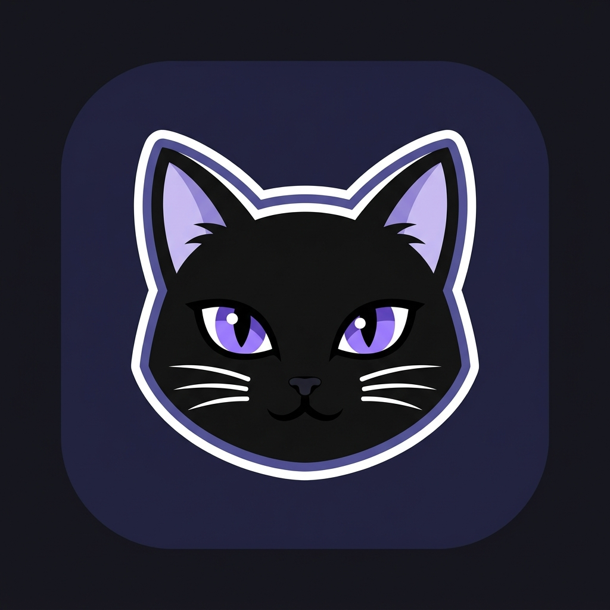

<p align="center">
  
</p>

<h1 align="center">NovelClaw</h1>

<p align="center">
  A desktop studio for translating and publishing novels — Go, Wails v3, React.
</p>

---

## What is NovelClaw?

NovelClaw is a desktop application for translating novels from source to target
language without losing the things that make a book a book.

It is not a wrapper around a translation API. It models the editorial process a
publishing house actually uses, and puts an autonomous agent in the middle of
it. You import a book, the agent profiles its style, builds a knowledge base of
characters and terminology, translates it chapter by chapter, critiques its own
draft, and exports a readable ebook with the original artwork and structure
intact.

The problems it exists to solve:

- **Pronouns drift.** Each chapter is translated with the relationship between
  characters *as of that chapter*, stored as a graph edge with a chapter
  timestamp — so a pair who address each other one way in chapter 1 and another
  way in chapter 10 stay consistent.
- **The model forgets the story.** Memory is layered by narrative function, and
  retrieval is bounded by chapter index so a search can only ever see the past.
- **Formatting is destroyed.** EPUB, MOBI, PDF, DOCX and friends survive the
  round trip with illustrations, footnotes, cover art and tables of contents
  preserved.
- **Cost runs away.** The prompt is assembled in a stable prefix order so
  providers can cache it, and context selection is a trie lookup rather than a
  similarity search.

You can drive everything by hand, or let the NovelClaw agent do it through
natural language — it has tools for the character graph, glossary, world bible,
pipeline control and export.

---

## Quick start

### Just want to use the app?

Download the build for your platform from the
[**Releases**](https://github.com/AzenKain/NovelClaw/releases) page and run it.
Nothing else is required — no Go, no Node, no compiler. The app updates itself
from that same page.

Everything below is only for people who want to build from source.

### Building from source

**Requirements**

- Go 1.27 or newer
- Node.js 20 or newer with npm
- Wails v3 CLI, pinned to the version in `go.mod`:

  ```bash
  go install github.com/wailsapp/wails/v3/cmd/wails3@v3.0.0-beta.24
  ```

**Linux** additionally needs GTK 4 and WebKitGTK 6.0 development headers plus a
C compiler for CGO. You do not have to install these by hand — let Wails check
and install them for you:

```bash
wails3 doctor-ng     # reports what is missing; press `i` to install it
```

It detects your distribution's package manager (apt, dnf, pacman, zypper,
emerge, xbps, eopkg, nixpkgs) and runs the right install command. Plain
`wails3 doctor` prints the same report and shows the command without running it.

Windows and macOS need nothing beyond the toolchain above.

**Install dependencies**

```bash
go mod download
```

Frontend dependencies are installed automatically by Wails the first time you
run or build, so there is no separate `npm install` step.

**Run in development**

```bash
wails3 dev
```

This starts the Vite dev server with hot reload and the Wails app together. Go
changes trigger a rebuild.

**Build a release**

```bash
wails3 package
```

Or use the Makefile shortcuts, which also mirror the version from
`pkg/appmeta/version.go` into the bundle metadata:

```bash
make build                    # quick local binary into bin/
make release-linux-amd64      # packaged release asset
make release-darwin-arm64
make release-win-amd64
make checksums                # SHA256SUMS for a local package output
```

Package output is platform-specific: AppImage/deb/rpm on Linux, NSIS on
Windows, an `.app` bundle on macOS.

### First run

On first launch a setup wizard asks for your interface language, an LLM provider
and its API key, and a fallback chain. Any OpenAI-compatible endpoint works, and
so do the native OpenAI, Gemini, Anthropic, DeepSeek, ViLao and Ollama presets.
After that, import a book and start translating.

Your data lives in one of two places, depending on the platform:

| Platform | Data directory |
| --- | --- |
| Windows | `./` — portable, next to the executable |
| macOS / Linux | `~/.novelclaw/` |

That directory holds the SQLite database, your soul personas, the agent skill
playbooks, and distilled skills learned from your edits. It is created and
migrated automatically on startup; the shipped defaults are embedded in the
binary, so a fresh install is never empty.

---

## Core

### Tech stack

**Backend**

- Go 1.27
- Wails v3 for the native desktop runtime and IPC bindings
- SQLite via `modernc.org/sqlite` — pure Go, no CGO
- `sqlc` for type-safe query generation from `db/schema` and `db/query`
- `zerolog` for structured logging
- `goldmark` for Markdown, `sonic` for JSON, `theine-go` for caching

**Frontend**

- React 19 with TypeScript, bundled by Vite
- Tailwind CSS v4, Zustand for state
- `react-i18next` for the five interface languages (EN, VI, JA, ZH, KO)
- React Flow for the character graph, lucide-react for icons

**Document handling**

- `bookparser` and `ebookconv`, both written in pure Go for this project
- EPUB, MOBI, AZW3, PDF, DOCX, ODT, FB2, RTF, TXT, Markdown, HTML, CBZ, CBR and
  common archive formats

### Architecture

```
main.go               Wiring only: bootstrap, dependency injection, window, run
internal/services/    Wails bindings that bridge the frontend to pkg/*
internal/dtos/        Types crossing the IPC boundary
internal/gen/sqlc/    Generated query code (do not edit)
pkg/*                 Pure logic, no Wails imports
frontend/src/         React UI
frontend/bindings/    Generated TypeScript bindings (do not edit)
db/schema, db/query   SQL source of truth, applied as numbered migrations
embed_defaults.go     Embeds the shipped skills and souls into the binary
```

The dependency direction is one-way: `main` → `internal/services` → `pkg`.
Nothing in `pkg` reaches back into the Wails runtime, which keeps the core
testable without a GUI.

Notable packages:

| Package | Responsibility |
| --- | --- |
| `pkg/bookparser`, `pkg/ebookconv` | Import and export with document structure preserved |
| `pkg/llm` | Provider clients, translation orchestrator, execution modes |
| `pkg/storage` | SQLite access, migrations, encrypted credential vault |
| `pkg/skills`, `pkg/soul` | Agent capability playbooks and persona definitions |
| `pkg/novelclaw` | The agent: context assembly, tool execution, auto-compaction |
| `pkg/graph`, `pkg/glossary`, `pkg/worldbible` | The layered knowledge base |
| `pkg/auditor`, `pkg/r19`, `pkg/voice` | Draft critique, content safety, voice consistency |
| `pkg/paths` | The single source of truth for every data path |
| `pkg/appmeta` | Version, storage layout, self-update wiring |

### Self-update

The app updates itself from GitHub Releases. Downloads are verified against the
published `SHA256SUMS`, and the binary is swapped in place by a helper process
on restart. The startup check is silent — it says nothing when you are already
current or offline, and only appears when there is a real update. The manual
**Settings → About → Check for updates** button does report errors.

The version has a single source of truth, so a release is just an edit plus a
tag:

```bash
# 1. edit pkg/appmeta/version.go:  const Version = "1.2.3"
# 2. commit, then tag and push — the tag must match the constant
git tag v1.2.3 && git push origin v1.2.3
```

`make sync-version` mirrors the constant into `build/config.yml` and regenerates
the bundle metadata (Info.plist, info.json, nfpm.yaml) from it. The release
workflow does the same and refuses to build when the pushed tag disagrees with
the constant.

---

## Contributing

Read [`AGENT.md`](AGENT.md) before changing code. It is short, and it is
binding — it covers the module boundaries, the storage and migration rules, the
embedding requirement for default resources, secrets handling, and the
pre-commit checklist.
